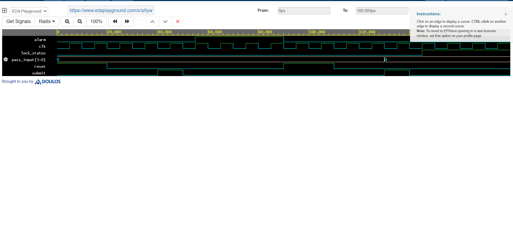

# Smart Digital Lock System using VHDL (FSM)

## 🚀 Project Overview
This repository contains the VHDL design and simulation of a structural **Smart Digital Lock System**. The system acts as a electronic passcode detector, utilizing a synchronous **Finite State Machine (FSM)** architecture to securely evaluate key inputs against a predefined secret password. The project was verified using the **EDA Playground** cloud environment.

## 🧠 State Machine Logic & Functionality
The hardware transitions through sequential states to maintain security routing:

| State | Condition to Transition | Output Status |
| :--- | :--- | :--- |
| `IDLE` | Waiting for the `enter` key signal | System Secured |
| `ENTERING_PASS` | Evaluates `key_input` against secret passcode | Processing |
| `SUCCESS` | Key input matches `"1100"` exactly | `unlocked = '1'` |
| `ALARM_STATE` | Key input fails to match secret passcode | `alarm = '1'` |

## 📊 Simulation Waveform Verification
The testbench validates both successful access paths and security breaches:
1. **Success Flow:** When `key_input` matches `1100` and `enter` pulses high, the `unlocked` signal moves to a high state.
2. **Breach Flow:** When an incorrect sequence (`0111`) is processed, the system drops into `ALARM_STATE` and drives the `alarm` output high.

### EPWave Timing Diagram

